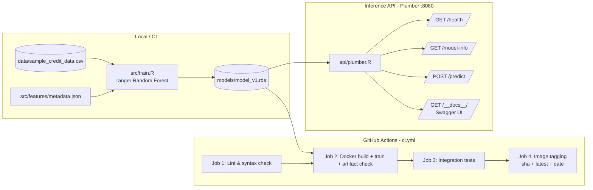

# Agibank Credit Risk MLOps Pipeline


> MLOps engineering challenge: operationalize an experimental R credit risk
> model (Home Credit Default Risk) into a robust, reproducible and automated
> production pipeline.

---

## 1. Overview

This repository implements a complete MLOps pipeline around a Random Forest
credit default model trained in **R**:

1. **Isolated training** – the model is trained inside a Docker container from
   environment variables, producing a reproducible `models/model_v1.rds`
   artifact.
2. **Inference REST API** – an R `plumber` API exposing `/predict`,
   `/health` and `/model-info`, with input validation, structured JSON logging
   and auto-generated Swagger/OpenAPI docs at `/__docs__/`.
3. **CI/CD automation** – a GitHub Actions workflow covering linting, Docker
   build, model training verification, API integration tests and image tagging.
4. **Feature & metadata management** – a versioned schema definition in
   `src/features/metadata.json` shared by training, validation and serving.

### Architecture



---

## 2. Repository Structure

```text
agibank-mlops-challenge/
├── .github/workflows/
│   └── ci.yml                 # CI/CD pipeline (lint, build, test, tag)
├── src/
│   ├── train.R                # Isolated training script (env-var driven)
│   ├── generate_sample_data.R # Synthetic Home Credit-like data generator
│   └── features/
│       └── metadata.json      # Versioned feature schema (schema 1.0.0)
├── api/
│   ├── plumber.R              # Plumber API: endpoints, validation, logging
│   └── start_api.R            # API entrypoint (host 0.0.0.0, configurable port)
├── models/
│   └── .gitkeep               # Trained artifacts land here (gitignored)
├── data/
│   └── sample_credit_data.csv # Sample dataset (auto-generated, seeded)
├── tests/
│   └── test_api.R             # testthat integration test suite
├── Dockerfile                 # rocker/r-ver:4.3.2 based image
├── docker-compose.yml         # train + api orchestration
├── entrypoint.sh              # train | serve | generate | test modes
├── requirements.R             # Idempotent R package installer
├── .dockerignore
└── .gitignore
```

---

## 3. Prerequisites

- [Docker](https://docs.docker.com/get-docker/) (with Compose v2)
- Git
- Optional: `curl` / Python `requests` for manual API testing

No local R installation is required – everything runs inside the container.

---

## 4. Quickstart

### 4.1 Download the dataset

To run and test de API **locally** :
1. Login into Kaggle with your account to download the [Home Credit Default Risk](https://www.kaggle.com/competitions/home-credit-default-risk/data)
2. Download the `.zip` file and place it on `data/` folder, so the feature store will be built upon it's data.

For integration purposes, CI/CD tests are performed with **generated data** within the built container, since Kaggle requires authentication token to pull data online during runtime.

### 4.2 Build the Docker image

```bash
docker build -t agibank-mlops .
```

### 4.3 Train the model

```bash
# Recommended: persist artifacts back into the repository
docker run --rm \
  -v "$(pwd)/models:/app/models" \
  -v "$(pwd)/data:/app/data" \
  agibank-mlops train
```

The script:

1. Resolves configuration from **CLI args → env vars → defaults**
   (`DATA_PATH`, `MODEL_OUTPUT_PATH`, `METADATA_PATH`, `LOG_LEVEL`, `NUM_TREES`);
2. auto-generates `data/sample_credit_data.csv` if it does not exist;
3. imputes missing values (median for numeric, mode for categorical);
4. trains a `ranger` Random Forest with `probability = TRUE` and a fixed seed;
5. logs evaluation metrics (AUC-ROC, Accuracy, LogLoss) as structured JSON;
6. saves the artifact to `models/model_v1.rds`.

Expected tail of the log output:

```json
{"timestamp":"2026-08-05T00:00:00Z","level":"INFO","logger":"train","message":"Training completed successfully","event":"training_metrics","metrics":{"algorithm":"ranger","auc_roc":0.83,"accuracy":0.79,"log_loss":0.45}}
{"timestamp":"2026-08-05T00:00:00Z","level":"INFO","logger":"train","message":"Model artifact saved","path":"models/model_v1.rds","version":"v1.0.0"}
```

### 4.4 Start the API

```bash
docker run --rm -d --name credit-api \
  -p 8080:8080 \
  -v "$(pwd)/models:/app/models" \
  agibank-mlops serve

# confirm it is healthy
curl -sf http://localhost:8080/health
```

Access the Plumber Swagger/OpenAPI docs on <http://localhost:8080/__docs__/>

### 4.5 Docker Compose (one-liner)

Useful to start both train and api at once:

```bash
# Train first, then start the API
docker compose up --build api
```

`docker-compose.yml` defines a `train` service and an `api` service that waits
for training to complete successfully.

### 4.5 Re-generate sample data

```bash
docker run --rm -v "$(pwd)/data:/app/data" agibank-mlops generate
# force regeneration
docker run --rm -v "$(pwd)/data:/app/data" agibank-mlops generate --force
```

---

## 5. API Documentation

### 5.1 Endpoints

| Method | Path          | Description                                                          | Success | Errors         |
| ------ | ------------- | -------------------------------------------------------------------- | ------- | -------------- |
| GET    | `/health`     | Container health check (model loaded?)                               | 200     | 503            |
| GET    | `/model-info` | Model metadata, feature schema, R version, artifact hash & size      | 200     | –              |
| POST   | `/predict`    | Default probability for a single record or an array of records       | 200     | 400, 500, 503  |
| GET    | `/__docs__/`  | Auto-generated OpenAPI / Swagger UI                                  | 200     | –              |
| GET    | `/`           | API overview (version, endpoints)                                    | 200     | –              |

### 5.2 Examples

#### `GET /health`

```bash
curl -s http://localhost:8080/health
```

```json
{
  "status": "healthy",
  "timestamp": "2026-08-05T12:00:00Z",
  "model_loaded": true,
  "model_version": "v1.0.0"
}
```

#### `GET /model-info`

```bash
curl -s http://localhost:8080/model-info | python3 -m json.tool
```

Returns the full `src/features/metadata.json` content plus:

```json
{
  "runtime": {
    "r_version": "R version 4.3.2 (2023-10-31)",
    "model_file": "model_v1.rds",
    "model_size_bytes": 1736283,
    "model_hash_md5": "9a8b7c6d5e4f3a2b1c0d9e8f7a6b5c4d",
    "trained_at": "2026-08-05T11:30:00Z"
  }
}
```

#### `POST /predict` (single record)

```bash
curl -s -X POST http://localhost:8080/predict \
  -H "Content-Type: application/json" \
  -d '{
    "AMT_INCOME_TOTAL": 150000.0,
    "AMT_CREDIT": 450000.0,
    "AMT_ANNUITY": 25000.0,
    "DAYS_BIRTH": -12000,
    "DAYS_EMPLOYED": -2000,
    "EXT_SOURCE_2": 0.55,
    "EXT_SOURCE_3": 0.42
  }'
```

```json
{
  "prediction_id": "req-9a8b7c6d",
  "timestamp": "2026-08-05T12:00:05Z",
  "default_probability": 0.1425,
  "risk_label": "LOW_RISK",
  "model_version": "v1.0.0",
  "processing_time_ms": 12.4
}
```

`risk_label` is `HIGH_RISK` when `default_probability >= 0.5` (configurable via
`thresholds.high_risk_cutoff` in the metadata schema).

#### `POST /predict` (batch)

```bash
curl -s -X POST http://localhost:8080/predict \
  -H "Content-Type: application/json" \
  -d '[
    {"AMT_INCOME_TOTAL":150000,"AMT_CREDIT":450000,"AMT_ANNUITY":25000,"DAYS_BIRTH":-12000,"DAYS_EMPLOYED":-2000,"EXT_SOURCE_2":0.55,"EXT_SOURCE_3":0.42},
    {"AMT_INCOME_TOTAL":60000,"AMT_CREDIT":200000,"AMT_ANNUITY":12000,"DAYS_BIRTH":-8000,"DAYS_EMPLOYED":-300,"EXT_SOURCE_2":0.21,"EXT_SOURCE_3":0.18}
  ]'
```

Returns an array of prediction objects, one per input record.

#### Invalid payload (400)

```bash
curl -s -X POST http://localhost:8080/predict \
  -H "Content-Type: application/json" \
  -d '{"AMT_INCOME_TOTAL": 150000}'
```

```json
{
  "error": "ValidationFailed",
  "message": "[record 1] Missing required field: AMT_CREDIT; Missing required field: AMT_ANNUITY; Missing required field: DAYS_BIRTH; Missing required field: DAYS_EMPLOYED; Missing required field: EXT_SOURCE_2; Missing required field: EXT_SOURCE_3",
  "timestamp": "2026-08-05T12:00:10Z"
}
```

Validation rules enforced by `/predict`:

- every required feature defined in `metadata.json` must be present;
- numeric features must be single, finite, non-null numeric values (strings,
  `null`, arrays and `Inf`/`NaN` are rejected with explicit messages).

### 5.3 Python `requests` example

```python
import requests

BASE_URL = "http://localhost:8080"

# Health check
print(requests.get(f"{BASE_URL}/health").json())

# Model info
print(requests.get(f"{BASE_URL}/model-info").json()["runtime"])

# Single prediction
payload = {
    "AMT_INCOME_TOTAL": 150000.0,
    "AMT_CREDIT": 450000.0,
    "AMT_ANNUITY": 25000.0,
    "DAYS_BIRTH": -12000,
    "DAYS_EMPLOYED": -2000,
    "EXT_SOURCE_2": 0.55,
    "EXT_SOURCE_3": 0.42,
}
resp = requests.post(f"{BASE_URL}/predict", json=payload)
print(resp.json())
# {'prediction_id': 'req-...', 'default_probability': 0.1425, 'risk_label': 'LOW_RISK', ...}

# Batch prediction
batch = [payload, payload]
print(requests.post(f"{BASE_URL}/predict", json=batch).json())
```

---

## 6. CI/CD Pipeline

`.github/workflows/ci.yml` runs on **push to `main`** and **PRs targeting on GitHub Actions
`main`**:

| Job                  | What it does                                                                                     |
| -------------------- | ------------------------------------------------------------------------------------------------ |
| `lint`               | Parses every `*.R` file with R's `parse()` in the rocker image, `bash -n` on `entrypoint.sh`, validates `metadata.json` |
| `build-and-train`    | `docker build`, runs `train` inside the container, asserts `models/model_v1.rds` exists & non-empty |
| `integration-tests`  | Starts the API container, health-check retry loop, runs `tests/test_api.R` via testthat + curl smoke tests |
| `docker-tagging`     | Tags the image with commit SHA / short SHA / date / `latest` and simulates the registry push     |

Jobs are independent (each builds the image from the checkout) so failures are
easy to localize; a registry push is intentionally **simulated** in the logs.

**Check out  `docs/ci`, which contains real CI testing on GitHub Actions**.

---

## 7. Configuration

All behavior is driven by environment variables (defaults shown):

| Variable            | Default                        | Used by     | Description                            |
| ------------------- | ------------------------------ | ----------- | -------------------------------------- |
| `DATA_PATH`         | `data/sample_credit_data.csv`  | train/gen   | Input dataset path                     |
| `MODEL_OUTPUT_PATH` | `models/model_v1.rds`          | train/api   | Model artifact path                    |
| `METADATA_PATH`     | `src/features/metadata.json`   | train/api   | Feature schema path                    |
| `PORT`              | `8080`                         | api         | API listening port                     |
| `LOG_LEVEL`         | `INFO`                         | train/api   | `TRACE`…`FATAL` structured log level   |
| `NUM_TREES`         | `300`                          | train       | Random Forest tree count               |
| `N_ROWS`            | `3000`                         | generate    | Sample dataset size                    |

CLI arguments (`--data-path`, `--model-output-path`, `--num-trees`, `--seed`,
etc.) always take precedence over environment variables.

---

## 8. Testing

```bash
# Start the API with a trained model first, then in another terminal:

# Option A - inside the running container
docker exec credit-api Rscript -e "testthat::test_file('tests/test_api.R', reporter = 'summary')"

# Option B - against any running instance (e.g. locally)
docker run --rm -v "$(pwd):/app" -e API_URL=http://host.docker.internal:8080 agibank-mlops test
```

The suite covers: `/health`, `/model-info`, valid/invalid single predictions,
missing / wrong-typed / null fields, empty bodies, batch requests, Swagger docs
and 404 handling.

---

## 9. Technical Decisions & Tradeoffs

**R + Plumber instead of Python FastAPI.**
Agibank's Data Science team models in R, so the production runtime mirrors the
research runtime. This removes the R→Python rewrite risk (feature parity,
inference skew) and lets the exact trained object (`ranger`) be served as-is.
Plumber is the de-facto R REST framework, supports OpenAPI 3 documentation
out-of-the-box (`/__docs__/`) and integrates natively with R's ecosystem.

**Validation driven by a single source of truth.**
Training, API validation and documentation all read
`src/features/metadata.json` (schema `1.0.0`). Features required by the schema
are validated by name and type at request time; the model itself stores its own
feature list so the API can never silently feed it the wrong columns. Tradeoff:
a manual JSON schema keeps zero extra dependencies – a formal `jsonvalidate`
step can be layered in later if the feature catalog grows.

**Batch-first prediction.**
`/predict` accepts both a single object and an array of objects, enabling
efficient scoring for loan-pool scenarios without a second endpoint. Batch
requests are fully validated before any scoring happens (fail fast, explicit
per-record error messages).

**Structured JSON logging everywhere.**
Training emits machine-readable JSON metrics to stdout; the API logs every
request (`method`, `path`, `user-agent`, status, latency) through a Plumber
filter. This is directly consumable by CloudWatch/ELK-style collectors and is a
prerequisite for any future monitoring/alerts.

**Reproducibility-first training.**
Fixed seed, env-var-driven paths, auto-generation of missing data, and a
dependency-free evaluation (AUC computed via the Mann-Whitney U statistic)
keep the training step deterministic and dependency-light. The model artifact
embeds version, training timestamp and metrics for full traceability.

## 📊 Data Modeling & Feature Store Motivation

The Home Credit Default Risk dataset is a multi-table relational schema centered around a primary key: `SK_ID_CURR` (the loan application ID). To transform this relational database into a tabular Feature Store for machine learning, all historical tables ($1:N$ relationships) are aggregated up to a $1:1$ grain per applicant before joining with `application_{train|test}.csv`.

### Why Specific Features Were Selected

1. **Core Application Snapshot (`application_{train|test}.csv`)**
   * `AMT_INCOME_TOTAL`, `AMT_CREDIT`, `AMT_ANNUITY`: Capture income-to-debt ratios and baseline leverage.
   * `DAYS_BIRTH`, `DAYS_EMPLOYED`: Proxy applicant stability and age demographics.
   * `EXT_SOURCE_2`, `EXT_SOURCE_3`: Normalized external risk scores provided by third-party credit bureaus (historically the strongest predictive signals in this dataset).

2. **External Bureau History (`bureau.csv` & `bureau_balance.csv`)**
   * `bureau_sum_debt` & `bureau_max_overdue`: Quantify existing indebtedness outside Home Credit and historical delinquency severity.

3. **Internal Application History (`previous_application.csv`)**
   * `prev_approval_rate` & `prev_refusal_rate`: Capture customer loyalty and past rejection patterns within Home Credit.

4. **Behavioral Delinquency Signals (`installments_payments.csv`)**
   * `inst_max_delay` & `inst_mean_underpayment`: Measure actual payment performance (`DAYS_ENTRY_PAYMENT - DAYS_INSTALMENT`). Late or incomplete payments are strong early indicators of default risk.

5. **Revolving Credit Behavior (`POS_CASH_balance.csv` & `credit_card_balance.csv`)**
   * `cc_max_dpd` & `pos_max_dpd`: Identify revolving credit utilization and maximum Days Past Due (DPD).

### Why RDS instead of parquet?

The processed feature store is saved as **`data/feature_store.rds`**:

- It keeps the feature store native to R, which preserves column types without extra conversion logic.
- It uses gzip compression out of the box, so the artifact stays compact for Docker and CI runs.
- It avoids Arrow/C++ build dependencies that would otherwise slow down the image and complicate the pipeline - what ensure a light-weight container.
---

### Running Data Modeling & RDS Generation Manually

You can test the data processing and RDS feature store generation locally or inside Docker.

No local R installation is required. Run the processing script inside the container with mounted volume paths:

```bash
docker run --rm \
  -v $(pwd)/data:/app/data \
  agibank-mlops:v1 \
  Rscript src/data_modelling.R --data-dir data/ --output-path data/feature_store.rds
```

The processed feature store keeps the 7 API-facing application columns. Two of
them are now exposed with user-readable names:

- `THIRD_PARTY_CREDIT_SCORE_2`: normalized third-party credit score from `application_train.csv` / `application_test.csv` (legacy source column `EXT_SOURCE_2`)
- `THIRD_PARTY_CREDIT_SCORE_3`: normalized third-party credit score from `application_train.csv` / `application_test.csv` (legacy source column `EXT_SOURCE_3`)


## Model Training

The model is trained after the feature store and test set modelling. Here is the training
workflow:

1. Reads `data/feature_store.rds` and filters the `is_train == 1` partition.
2. Uses the 7-feature contract from `src/features/metadata.json`
   (`AMT_INCOME_TOTAL`, `AMT_CREDIT`, `AMT_ANNUITY`, `DAYS_BIRTH`,
   `DAYS_EMPLOYED`, `THIRD_PARTY_CREDIT_SCORE_2`, `THIRD_PARTY_CREDIT_SCORE_3`).
3. Imputes missing values (median for numeric, mode for categorical) and
   records the mapping in the artifact.
4. Trains a `ranger` probability **Random Forest** classifier, performing a cross-validation
spliting the training set in 5-folds (80% train, 20% validation),
   run in parallel across `NUM_CORES` workers (default: detected cores).
   Lower `NUM_CORES` to bound peak memory on hosts with modest RAM.
5. Logs out-of-fold metrics (AUC-ROC via the Mann-Whitney U rank statistic,
   Accuracy, LogLoss) as structured JSON.
6. Re-trains the final model on all training rows and saves
   `models/model_v1.rds`.
7. Writes `data/features_metadata.json` and
   `models/performance_result.json` for offline performance tracking.


```bash
# Train inside the container (persists artifacts into the repo)
docker run --rm \
  -v "$(pwd)/models:/app/models" \
  -v "$(pwd)/data:/app/data" \
  agibank-mlops train
```

Configuration is resolved as **CLI args → env vars → defaults** (`DATA_PATH`,
`FEATURE_STORE_PATH`, `TEST_SET_PATH`, `RAW_DATA_ZIP`, `MODEL_OUTPUT_PATH`,
`NUM_TREES`, `NUM_CORES`, `SEED`).

### 1. Why Perform 5-Fold Cross-Validation?

* **Prevents Overfitting & Variance Bias:** Evaluating a credit model on a single static train/validation split introduces sampling bias—the model might perform exceptionally well or poorly simply due to how that specific split was created. 5-Fold Cross-Validation guarantees that every sample in the dataset serves as validation data exactly once.
* **Unbiased Out-of-Fold (OOF) Baselines:** Generating predictions out-of-sample across all 5 folds produces a complete, un-leakaged set of Out-of-Fold (OOF) probability scores. This gives an honest estimate of how the model will generalize to unseen production data before deployment.
* **Maximizes Data Efficiency:** In complex credit datasets with aggregated relational tables, data is valuable. Cross-validation uses 100% of the training dataset for both learning (in 80% chunks) and validation (in 20% chunks), eliminating the need to set aside a large static validation set.

### 2. Why Use AUC-ROC as the Primary Evaluation Metric?

* **Class Imbalance Resilience:** Credit default datasets are heavily imbalanced (e.g., ~8% defaults vs. ~92% non-defaults in Home Credit). Metrics like standard **Accuracy** are misleading: a naive model predicting "no default" for every customer would achieve 92% accuracy while missing 100% of risky applicants. AUC-ROC measures ranking capability independent of class prevalence.
* **Threshold Independence:** AUC-ROC evaluates the model’s fundamental capacity to rank a defaulting applicant ($\text{TARGET} = 1$) higher than a non-defaulting applicant ($\text{TARGET} = 0$) across all possible probability thresholds ($0.0$ to $1.0$). This decouples model assessment from operational business rules.
* **Direct Equivalence to Financial Risk Standards (Gini Index):** Credit risk and banking regulators universally evaluate scoring models using the **Gini Coefficient** (Power Statistic). AUC-ROC maintains a direct mathematical relationship with Gini:
  $$\text{Gini} = 2 \times \text{AUC} - 1$$
  Optimizing AUC-ROC directly maximizes the discriminatory power required by credit risk committees and banking frameworks.


---

## 10. Troubleshooting

| Symptom                                                | Fix                                                             |
| ------------------------------------------------------ | --------------------------------------------------------------- |
| `/health` returns `503`                                | Model not loaded – run `train` first and mount `./models` into the API container |
| API returns 400 for your request                       | Check `metadata.json` for the required fields; ensure numbers are numeric, not strings |
| `docker compose up api` waits forever                  | Training failed – check `docker compose logs train`             |
| Want to retrain with more trees                        | `docker run --rm -v "$(pwd)/models:/app/models" -v "$(pwd)/data:/app/data" -e NUM_TREES=1000 agibank-mlops train` |
| Running tests outside Docker without R                 | Use the container: `docker run --rm -v "$(pwd):/app" -e API_URL=http://host.docker.internal:8080 agibank-mlops test` |

---

## 11. License & Disclaimer

Sample data is synthetic and generated locally – no real customer data is
involved. This project is an engineering exercise for the Agibank MLOps
challenge.


